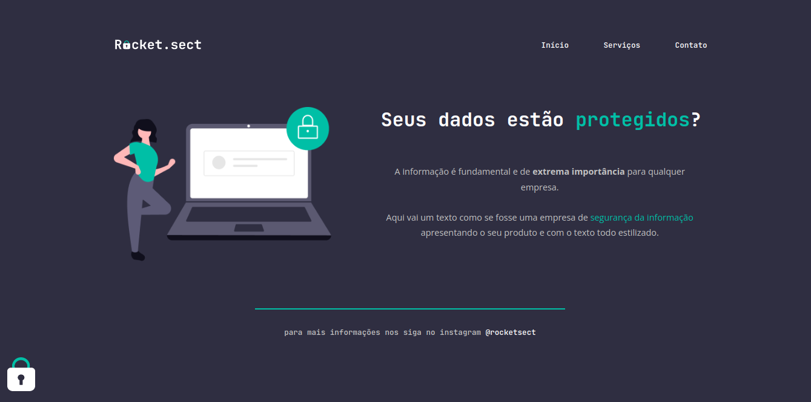

#  Explorer - Desafio Recriando layout

### ****Rocket.sect Website - Recriando layout**

### 📌 Trabalhando com a ferramenta Figma foi densenvolvido o projeto para transformar um layout em html e css do Zero. Estruturação HTML com tags semânticas, estilização CSS e acessibilidade.

🔗 Link -> <a href="https://rodrigoluigi.github.io/LP-Rocket.sect/" target="_blank">Rocket.sect</a>
#   _**O que desenvolvemos neste Projeto?**_

Projeto simples de uma página estática. Desenvolvemos toda a estrutura html, buscando sempre as melhores tags para se utilizar de forma semântica, utilizamos fontes e cores personalizadas, links, posicionamentos , espaçamentos , bordas, alinhamentos, conceitos de **Flexbox** e **BoxModel**.

- Ferramenta Figma;
- Ferramenta DevTools;
- Tags semânticas;
- Estrutura do HTML;
- Estrutura do CSS;
- Conceitos do Box Model;
- Conceitos do Flexbox;
- Personalização de fontes e cores;
- Personalizar textos;
- Trabalhar com cores no CSS;
- Trabalhar com espaçamentos;
- Posicionamento de elementos;

| **Fontes** |
| ----------------- | 
| **[Open Sans - Google Fonts](https://fonts.google.com/specimen/Open+Sans?query=open+sans)** |
| **[JetBrains Mono - Google Fonts](https://fonts.google.com/specimen/JetBrains+Mono?query=Jet)** |
    

  | **Cores**               |                                                 |
| ----------------- | ---------------------------------------------------------------- |
|  #2F2E41       |  #C2C2C2 |
|  #00bfa6       |  #FFFFFF |

## 📚 Stack utilizada

  
  

  

## Screenshots

