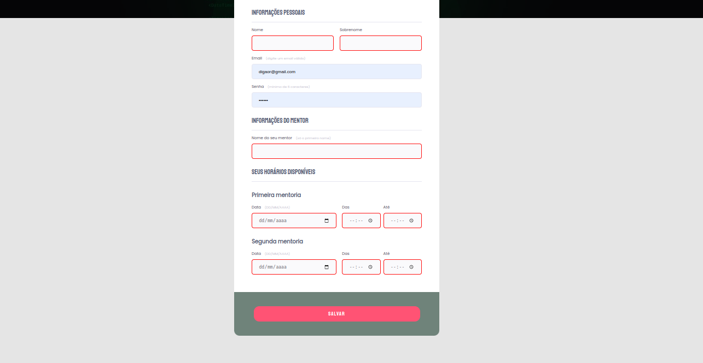

#  Explorer - Desafio Criando Formulários

**Formulário Mentoria**

### 📌 Trabalhando com a ferramenta Figma foi desenvolvido o projeto para transformar um layout em html e css.

🔗 Link -> <a href="https://rodrigoluigi.github.io/LP-Form-Mentoria/" target="_blank">Formulário Mentoria</a>

#   _**O que desenvolvemos neste Projeto?**_

Projeto de uma página estática, na qual trabalhamos com formulários para capturar dados através da web. Desenvolvemos um formulário clean com HTML e CSS, utilizamos campos de entrada(imput) , campos de texto, data e hora, submit, validação de imputs e configuração de estilos seguindo layout do Figma.

- Ferramenta Figma
- Tags semânticas
- Estrutura do HTML
- Estrutura do CSS
- Trabalhar com inputs no HTML
- Funcionamento dos formulários na Web
- Métodos GET e POST
- Configurar o Live server no VS Code
- Trabalhar com *pseudo-elements* no CSS
- Validar campos de formulários
- Responsividade Media *query*

| **Fontes** |
| ----------------- | 
| 🔗 **[Poppins - Google Fonts](https://fonts.google.com/specimen/Poppins?query=Poppins)** |
| 🔗 **[Staatliches - Google Fonts](https://fonts.google.com/specimen/Staatliches?query=staa)** |
    

  | **Cores**               |                                                 |
| ----------------- | ---------------------------------------------------------------- |
|  #E5E5E5       |  #52586f |
|  #FFFFFF       |  #535971 |
|  #6f837a |  #FF5374 |
|  #FF1010       |  #d0435f |

## 📚 Stack utilizada

  
  

## Screenshots

