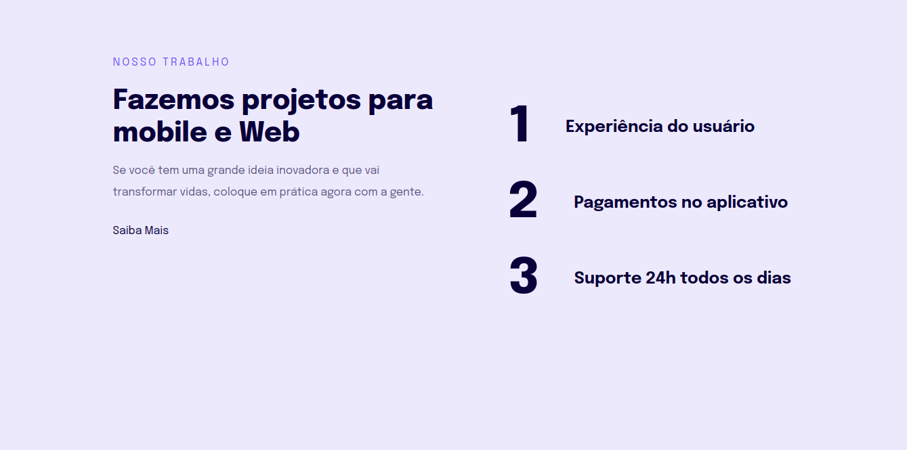

#  Explorer - Projeto 2

**Nossos Trabalhos Website**

### 📌 Trabalhando com a ferramenta Figma desenvolvemos o projeto para transformar um layout em html e css.

🔗 Link -> <a href="https://rodrigoluigi.github.io/LP-Nossos-Trabalhos/" target="_blank">Nossos Trabalhos</a>

#   _**O que desenvolvemos neste Projeto?**_

Projeto de uma página estática simples, na qual trabalhamos com desenvolvimento mobile-first, design responsivo, e unidades de medidas flexiveis. Desenvolvimento utilizando clean code e tags semânticas com HTML e CSS.

- Ferramenta Figma;
- Tags semânticas;
- Estrutura do HTML;
- Estrutura do CSS;
- Trabalhando com unidades de medidas flexiveis;
- Mobile-First;
- Responsividade Media *queries*

| **Fontes** |
| ----------------- | 
| 🔗 **[Epilogue - Google Fonts](https://fonts.google.com/specimen/Poppins?query=Poppins)** |
    

  | **Cores**               |                                                 |
| ----------------- | ---------------------------------------------------------------- |
|  #ECE9FD       |  #090039 |
|  #7158EF       |  |

## 📚 Stack utilizada

  
  

  

## Screenshots

