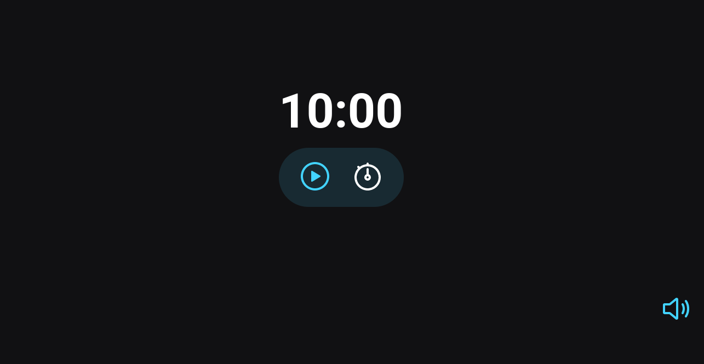

#  Explorer - Projeto 02

**Focus Timer CountDown**

### 📌 Cronômetro CountDown

🔗 Link -> <a href="https://rodrigoluigi.github.io/Timer-Coutdown/" target=_blank>Focus Timer</a>

#   _**O que desenvolvemos neste Projeto?**_

Projeto de um **timer ou cronômetro** para marcar um determinado período de tempo. Foi desenvolvido toda a estrutura do html, buscando sempre as melhores tags para se utilizar de forma semântica, estilização CSS, e funcionalidades através do JavaScript.

-  Tags semânticas;
-  Acessibilidade;
-  Modulação do JavaScript (ES6 MODULES)
-  Manipulação do DOM
-  Funções de callbacks
-  Recursividade
-  Padrão Factory
-  Injeção de dependências
-  Refatoração;
-  Clean-code

| **Fontes** |
| ----------------- | 
| 🔗 **[Roboto - Google Fonts](https://fonts.google.com/specimen/Roboto)** |
    

| **Cores**               |                                                 |
| ----------------- | ---------------------------------------------------------------- |
|  #FFFFFF       |  #121214 |
|  #42d3ff       |  #42d3ff21 |

## 📚 Stack utilizada

  
  
  

## Screenshots

