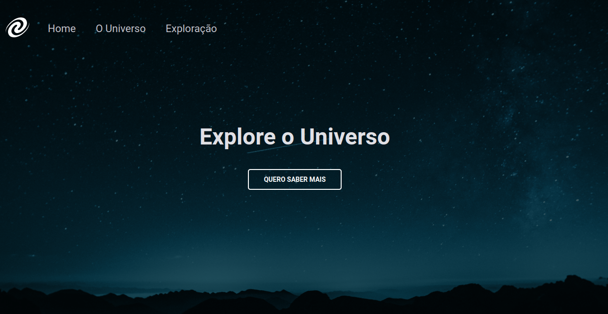

#  Explorer - Desafio SPA Universe 

**SPA Universe**

### 📌 Desenvolvimento de uma **Single page aplication - SPA** com base em layout do figma.

#   _**O que desenvolvemos neste Projeto?**_

 Foi desenvolvido um Website "SPA Universe" para trabalhar conceitos de SPA e POO contendo três seções, 'Home','About' e 'Exploration'. Foi desenvolvido toda a estrutura do html em arquivos separados, e foi trabalhado as rotas para acessar os arquivos, estilização CSS, e funcionalidades através do JavaScript. Também foi criado um mini-servidor com **node lite-server** para rodar a aplicação.

-  Tags semânticas;
-  Acessibilidade;
-  Media Queries (responsividade)
-  Conceito SPA
-  Manipulação do DOM
-  Utilização do Event.preventDefault()
-  Propriedade JS para exibir rotas - window.location.pathname
-  Modulação do JavaScript (ES6 MODULES)
-  Assincronismo 
-  Promises
-  Conceitos da POO
-  Classes
-  Herança
-  Polimorfismo
-  Refatoração
-  Clean-code
-  node Lite-server - *npm install lite-server

| **Fontes** |
| ----------------- | 
| 🔗 **[Roboto - Google Fonts](https://fonts.google.com/specimen/Roboto)** |
| 🔗 **[Roboto Mono - Google Fonts](https://fonts.google.com/specimen/Roboto+Mono)** |
    

| **Cores**               |                                                 |
| ----------------- | ---------------------------------------------------------------- |
|  #c3c3cb       |  #e0e0e5 |      
|  #ffffff    |      | 

## 📚 Stack utilizada

  
  
  

## Screenshots

