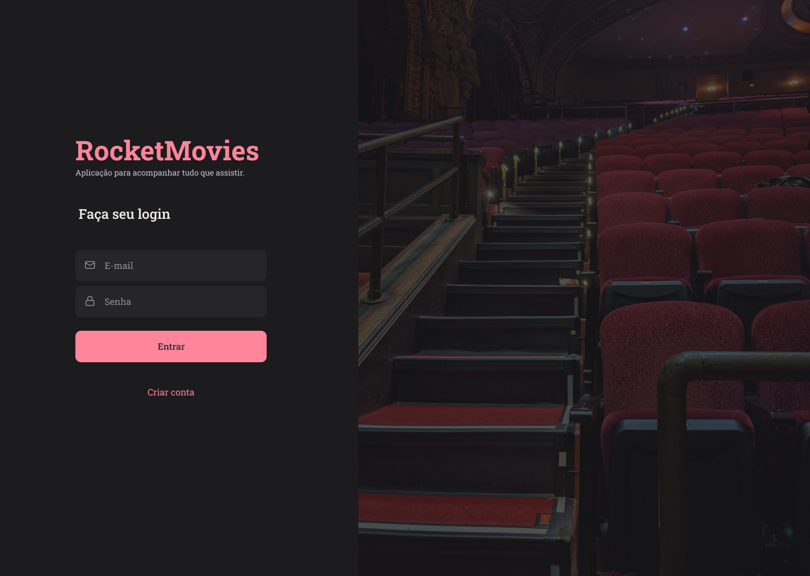
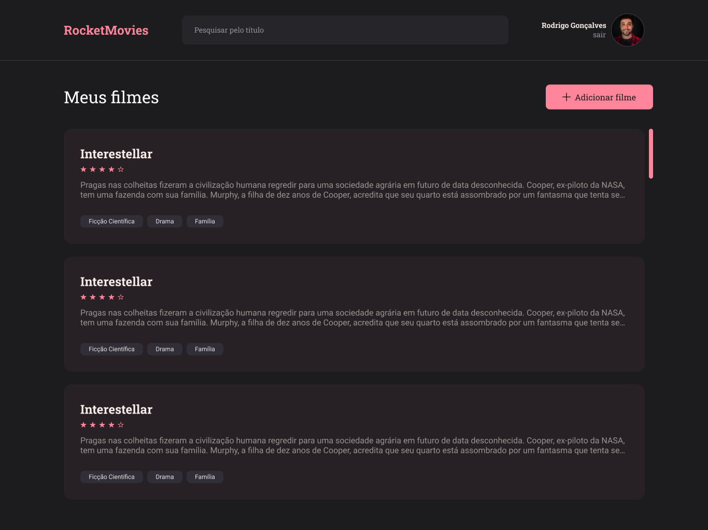
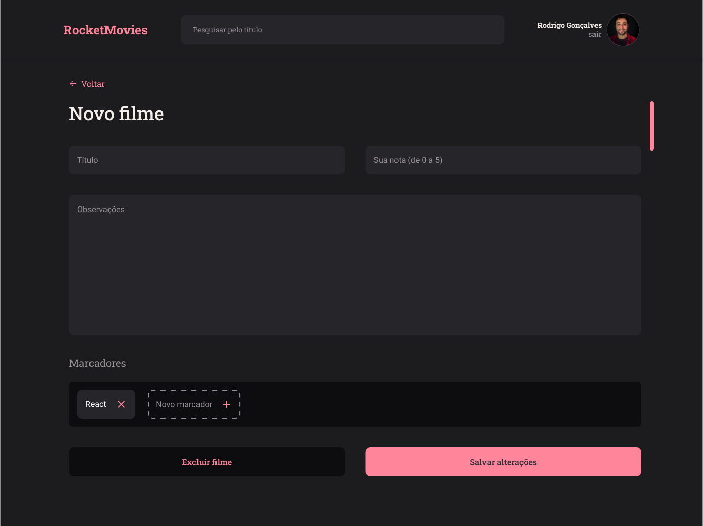
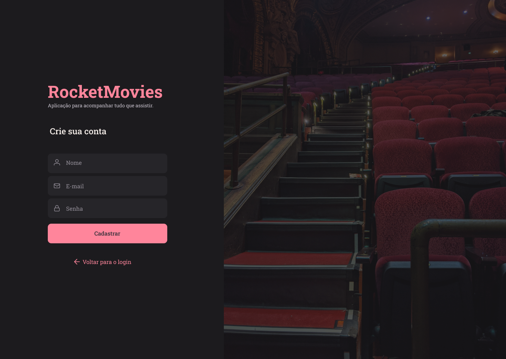

# <h1 id="top" align="center">🎬 Rocket**Movies** 📽</h1>

<p align="center">
  <a href="#sobre">Sobre</a> &#xa0; | &#xa0; 
  <a href="#gear-features">Features</a> &#xa0; | &#xa0;
  <a href="#books-bibliotecas">Tecnologias</a> &#xa0; | &#xa0;
  <a href="#-requisitos">Requisitos</a> &#xa0; | &#xa0;
  <a href="#checkered_flag-iniciando">Iniciando</a> &#xa0; | &#xa0;
  <a href="https://github.com/RodrigoLuigi" target="_blank">Author</a>
</p>

## Screenshots
<div align="center">
  
  
  
  
  
  
</div>

 <br><hr>

##  _**O que desenvolvemos neste Projeto?**_

📌 RocketMovies é uma Aplicação para gerenciar anotações sobre filmes e séries. O usuário poderá cadastrar notas, atribuir ranking para cada filme com tags vinculados a nota. O usuário poderá fazer buscas de notas cadastradas, bem como lista-las. Cada usuário terá seu próprio perfil e também poderá atualiza-lo. 
## :gear: Features ##

:heavy_check_mark:  Cadastro de usuário\
:heavy_check_mark: Login\
:heavy_check_mark: Perfil do usuário\
:heavy_check_mark: Cadastro de Notas\
:heavy_check_mark: Pesquisar por Notas\
:heavy_check_mark: Listar Notas\
:heavy_check_mark: Detalhes da Nota
## :books: Bibliotecas ##

_**As seguintes bibliotecas foram utilizadas neste projeto:**_

- [ReactJs]()
- [Styled-Components]()
- [Axios]()
- [Toastify]()
- [react-confirm-alert]()
- [react-icons]()
## 📝 Requisitos ##

- [Git](https://git-scm.com) 
- [Node](https://nodejs.org/en/)
- [npm](https://www.npmjs.com/)

## :checkered_flag: Iniciando ##

```bash
# Clone este projeto
$ git clone https://github.com/RodrigoLuigi/RocketMovies-Frontend.git
# Acesse o projeto
$ cd RocketMovies-Frontend
# Instale as dependências
$ npm install
# Execute o projeto com npm
$ npm run dev
# O Server irá inicializar em http://localhost:3333
```


&#xa0;

_**Feito por <a href="https://github.com/RodrigoLuigi" target="_blank">Rodrigo Luigi</a>**_  👨‍🚀

<a href="#top">Back to top</a>

