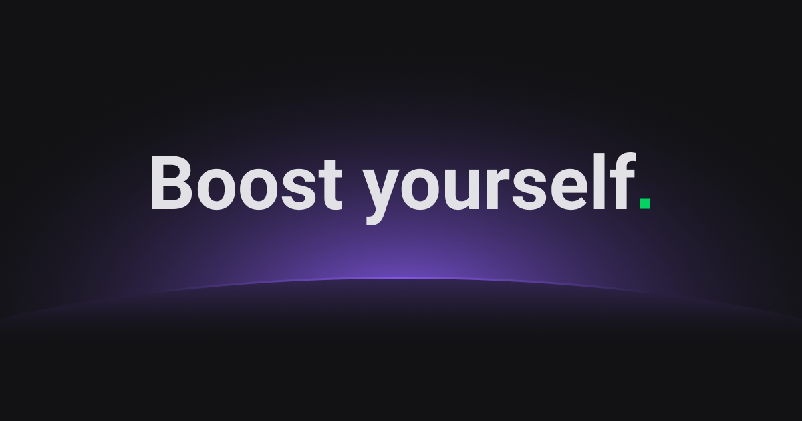

# Comunicação eficiente

- Conta pra gente quem é o seu parceiro(a).

- Onde você buscou esse parceiro(a)? (Por exemplo: Discord, LinkedIn, etc)

- O que foi visto nessa aula que mais te ajudou nesse momento?